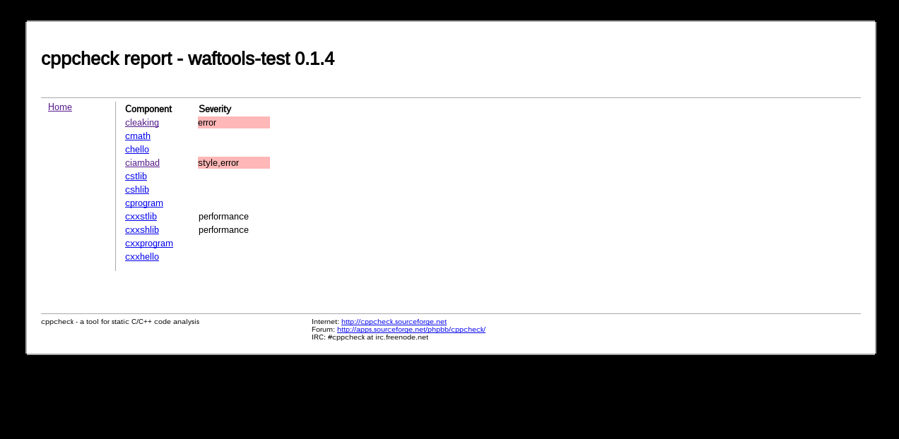
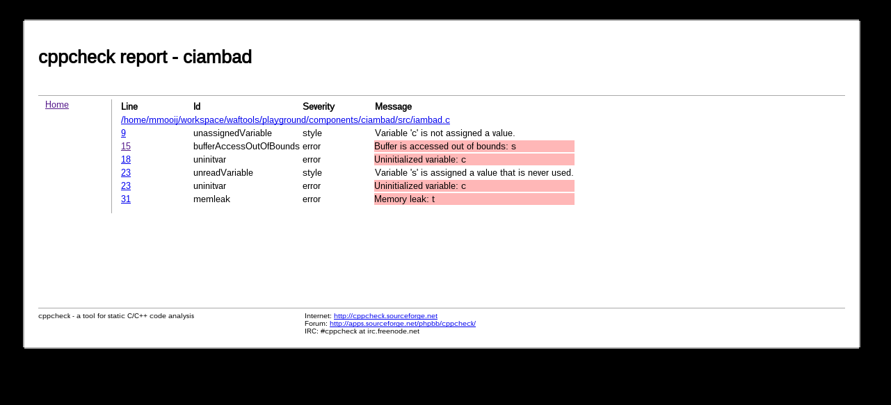
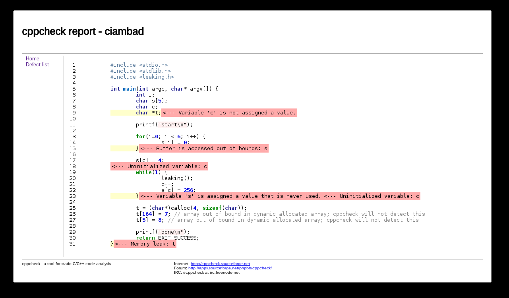

.. waftools documentation master file, created by
   sphinx-quickstart on Mon Mar 31 23:16:45 2014.
   You can adapt this file completely to your liking, but it should at least
   contain the root `toctree` directive.

Waftools 0.3.6 documentation
============================
Welcome! This is the documentation for the *waftools* package, last updated 
November 10\ :sup:`th`\  2014.

Overview
========
The *waftools* package contains a collection of tools for the waf_ build environment.

The waf_ framework provides a meta build system allowing users to create
concrete build systems. Out of the box it provides support for building and 
installation of programs for a myriad of programming languages (C, C++, Java, 
Python, Fortran, Lua, ...), when needed new functions (e.g. source code 
checking) can be added to a concrete build solution using *tools* which can be
imported and used in *wscript* build files. See the wafbook_ for a detailed 
description of the waf_ meta build system structure and usage.

The *waftools* package provides a collection of *tools* focused on development
projects using the C/C++ programming languages. When installed these tools can
be imported and used from any *wscript* file of a concrete waf_ build system.
Following provides a non-exhausting list of functions provided by this package:

- C/C++ source code checking using **CppCheck** (including *HTML* reports)
- Create C/C++ documentation using **DoxyGen**
- C/C++ export to IDE's (e.g. **CodeBlocks**, **Eclipse**, **VisualStudio**)
- Clean and format C/C++ source code using **GNU** indent
- Create installers using **NSIS**
- C/C++ export to makefiles (e.g. **make**, **cmake**)
- List dependencies between build tasks
- Use 'unity' and 'batched_cc' tools when available (waf-1.8.x)

Installation
============
The preferred to install this package is by means of the Python package installer::

	pip install -I waftools
	
If this, for some reason does not work, you can allso clone the repository and install 
the package from it::

	cd ~
	git clone https://bitbucket.org/Moo7/waftools.git waftools
	cd waftools
	python setup.py sdist install

Contained within the *waftools* package is a special install script which can be used to 
install the waf build system itself::

	wafinstall [--version=version] [--tools=unity,batched_cc]

Using the *--tools* command line option, the *waf* tools to be installed from 
*waflib/Tools/extras* can be specified in a comma separated list. When omitted no 
tools from *extras* will be installed.

Usage
=====

Cross compilation
-----------------
The code snippet below provides an example of how a complete build environment
can be created allowing you to build, not only for the host system, but also 
for one or more target platforms using a C/C++ cross compiler::

	#!/usr/bin/env python
	# -*- encoding: utf-8 -*-

	import os, waftools
	from waftools import ccross

	top = '.'
	out = 'build'
	prefix = 'output'
	ccrossini = os.path.abspath('ccross.ini').replace('\\', '/')

	VERSION = '0.0.1'
	APPNAME = 'cross-test'

	def options(opt):
		opt.add_option('--prefix', dest='prefix', default=prefix, help='installation prefix [default: %r]' % prefix)
		opt.load('ccross', tooldir=waftools.location)

	def configure(conf):
		conf.load('ccross')

	def build(bld):
		ccross.build(bld, trees=['components'])

	for var in ccross.variants(ccrossini):
		for ctx in ccross.contexts():
			name = ctx.__name__.replace('Context','').lower()
			class _t(ctx):
				__doc__ = "%ss '%s'" % (name, var)
				cmd = name + '_' + var
				variant = var

When loading and configuring the *ccross* tool, as shown in the example above, all 
required C/C++ tools for each build environment variant (i.e. native or cross-
compile) will be loaded and configured as well; e.g. compilers, makefile-, cmake-, 
eclipse-, codeblocks- and msdev exporters, cppcheck source code checking, doxygen 
documentation creation will be available for each build variant. Cross compile 
build environments can be specified in a seperate .INI file (named ccross.ini 
in the example above) using following syntax::

	[arm]
	prefix = arm-linux-gnueabihf

The section name, *arm* in the example above, specifies the name of the cross-compile
build environment variant. The prefix will be in used to create the concrete names of
the cross compile toolchain binaries::

	AR	= arm-linux-gnueabihf-ar
	CC	= arm-linux-gnueabihf-gcc
	CXX	= arm-linux-gnueabihf-g++

Concrete build scripts (i.e. wscript files) for components can be placed somewhere 
within the *components* sub-directory. Any top level wscript file of a tree (being 
*components* in this example) will be detected and incorporated within the build 
environment. Any wscript files below those top level script files will have to be 
included using the *bld.recurse('../somepath')* command from the top level script 
of that tree.

Code checking
-------------
C/C++ source code can be checked using the **CppCheck** static source analysis 
tool. Results of sources checked by **CppCheck** will be presented in a HTML
based report. The report contains a single index file containing a summary of 
defects containing links to detailed reports, one for each component (i.e. C/C++
program, static- or shared library):

	
	summary of defects found.
	
For each component a detailed report contains the defects found stating the
defect type, its severity and line number on which the defect has been detected:

	defects per file.

Clicking on the line number will show the source code with a colorfull marker for
each defect that has been detected:

	
	source code with highlighted defects.

The code snippet below presents a *wscript* example using the *cppcheck* source
code analysis tool::

	import waftools

	def options(opt):
		opt.load('compiler_c')
		opt.load('cppcheck', tooldir=waftools.location)
	
	def configure(conf):
		conf.load('compiler_c')
		conf.load('cppcheck')

	def build(bld):
		bld.program(target='hello', source='hello.c')

Using this code snippet, source code can be inspected and HTML reports can 
be generated using the following command::

	waf clean build --cppcheck --cppcheck-err-resume

.. note::
	A (re)build is required in order to perform the source code analysis.

Once completed the HTML report can be found and at: **./reports/cppcheck/index.html**

Code documentation
------------------
For C/C++ build tasks source code documentation can be created using 
**DoxyGen**. Once generated the documentation can be found at: 
**./reports/doxygen/**.

The code snippet below presents a *wscript* example using the *doxygen*
source code documentation tool::

	import waftools

	def options(opt):
		opt.load('compiler_c')
		opt.load('doxygen', tooldir=waftools.location)
	
	def configure(conf):
		conf.load('compiler_c')
		conf.load('doxygen')

	def build(bld):
		bld.program(target='hello', source='hello.c')

Using this code snippet, source code documentation can be generated using
the following command::

	waf doxygen

For more information please refer to the detailed description of the 
:ref:`doxygen <mod_doxygen>` module.

Export to IDE's
---------------
C/C++ build tasks (i.e. programs, static and shared libraries) can
be exported to project, workspace and/or solution files for either 
**Code::Blocks**, **Eclipse** (using CDT) or **MSDev** (Microsoft
Developer Studio).

The code snippet below presents a *wscript* that provides support
for export to **Eclipse**::

	import waftools

	def options(opt):
		opt.load('compiler_c')
		opt.load('eclipse', tooldir=waftools.location)
	
	def configure(conf):
		conf.load('compiler_c')
		conf.load('eclipse')

	def build(bld):
		bld.program(target='hello', source='hello.c')

Using this code snippet, **Eclipse** projects can be exported using
the following command::

	waf eclipse

When no longer needed all exported project files from a tree can simply
removed using the following command::

	waf eclipse --clean

For more information please refer to the detailed description of the 
:ref:`codeblocks <mod_codeblocks>`, :ref:`eclipse <mod_eclipse>` and 
:ref:`msdev <mod_msdev>` modules.

Packaging and installers
------------------------
For windows targets platforms installers can be created using the NullSoft
Installable Scripting system (**NSIS**). If no user defined .nsi script is 
provided a default one will be created in the top level directory of the 
build system.

The code snippet below presents a *wscript* that provides support for
creating installers using **NSIS**::

	import waftools

	def options(opt):
		opt.load('compiler_c')
		opt.load('package', tooldir=waftools.location)
	
	def configure(conf):
		conf.load('compiler_c')
		conf.load('package')

	def build(bld):
		bld.program(target='hello', source='hello.c')

Using this code snippet, a Windows installer can be created using
the following command::

	waf package --formats=nsis

For more information please refer to the detailed description of the 
:ref:`package <mod_package>` module.

Export to (c)make
-----------------
When needed C/C++ build tasks (programs, static or shared libraries) can be
exported to other build system formats (e.g. make, cmake). When doing so the 
definitions and settings as defined within the waf_ build environment will be
exported to those foreign build formats with the intend of keeping the same 
structure and behavior as defined within the waf build system as much as 
possible. Generated makefiles, for instance, will build out of tree and will 
use the same installation installation prefix.

The code snippet below presents a *wscript* example using the *makefile* export
module::

	import waftools

	def options(opt):
		opt.load('compiler_c')
		opt.load('makefile', tooldir=waftools.location)
	
	def configure(conf):
		conf.load('compiler_c')
		conf.load('makefile')

	def build(bld):
		bld.program(target='hello', source='hello.c')

Using this code snippet, the meta-data for the *C* program *hello* can be 
exported to **GNU** *MakeFiles* using the following commands::

	waf configure
	waf makefile

Note that makefiles will be exported at the location as the orginating 
wscript files (i.e. useally somewhere in the source tree). All exported 
makefiles can, when needed, be simply removed using the *clean* command::

	waf makefile --clean

Once exported *make* can be used to the building without futher need for,
or dependency to the waf build system.

For more information please refer to the detailed description of the 
:ref:`cmake <mod_cmake>` and :ref:`makefile <mod_makefile>` modules.

Modules
=======
Following links provide a detailed description for each module contained within
this package:

.. toctree::
   :maxdepth: 2

   waftools

Indices and tables
==================

* :ref:`genindex`
* :ref:`modindex`
* :ref:`search`

Credits
=======
The report generations part of the *cppcheck* tool is based on a script (of 
which the author is unknown to me) as provided by **CppCheck** itself. Some of 
the other modules (e.g. **Eclipse**, **Makefile**) are originally based on 
existing tools and examples as provided by Thomas Nagy, the author of the waf_
meta build system.

.. _waf: https://code.google.com/p/waf/
.. _wafbook: http://docs.waf.googlecode.com/git/book_17/single.html

